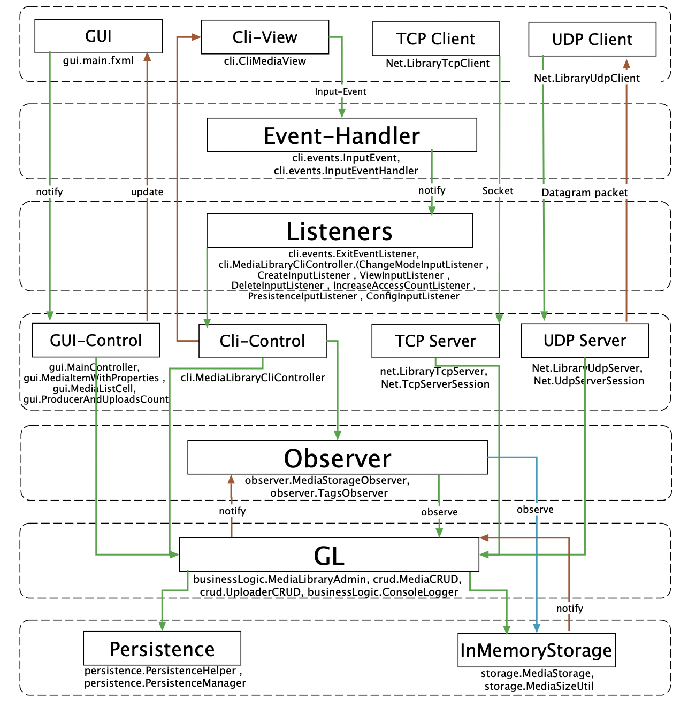

# Media Library

##Architecture Diagram:

##Architecture layers:
######Layer 1: Presentation layer
- Cli View
- GUI
- TCP client
- UDP client
######Layer 2: Event handler
- Event handler
######Layer 3: Cli Event listeners
- ExitEventListener
- MediaLibraryCliController.ChangeModeInputListener (user select input mode)
- MediaLibraryCliController.CreateInputListener (:c)
- MediaLibraryCliController.ViewInputListener (:r)
- MediaLibraryCliController.DeleteInputListener (:d)
- MediaLibraryCliController.IncreaseAccessCountListener (:u)
- MediaLibraryCliController.PersistenceInputListener (:p)
- MediaLibraryCliController.ConfigInputListener (:config)
######Layer 4: Control layer:
- GUI-Control
- Cli-Control
- UDP server
- TCP server
######Layer 5: Observers:
- MediaStorageObserver
- TagsObserver
######Layer 6: Business Logic (GL)
- MediaLibraryAdmin
- CRUD
######Layer 7: Data layer
- Persistence (JPB, JOS and Random Access File)
- MediaStorage (in memory storage)

-----
##Layers communication: Top -> down
######Layer 1 (Presentation layer) -> Layer 2 (Event handler)
- Cli view notifies EventHandler of the input events
######Layer 1 (Presentation layer) -> Layer 4 (Control layer):
- TCP client connect to TCP sever using a socket
- UDP client sends Datagram packet to UDP server
- GUI sends user actions and input to GUI-Control
######Layer 2 -> Layer 3 (Cli Event listeners)
Event handler notifies the listeners of the input event
######Layer 3 (Cli Event listeners) -> Layer 4 (Control layer):
- Cli-Control gets the updates from listeners
######Layer 4 (Control layer) -> Layer 5 (Observers)
- Cli-Control register observers based on user input
######Layer 4 (Control layer) -> Layer 6 (GL)
- Cli-Control updates the GL from events (create, update, delete, list, persistence)
- GUI-Control updates the GL from user input and actions
######Layer 5 (Observers) -> Layer 6 (GL)
- Tags Observer registered to get the GL updates
######Layer 5 (Observers) -> Layer 7 (Data layer)
- Storage Observer registered to get the storage updates
######Layer 6 (GL) -> Layer 7 (Data layer)
- GL saves media to in memory storage (MediaStorage)
- GL saves to file system using JOS or JBP or random access files

##Layers communication: Bottom -> Up
######Layer 4 (Control layer) -> Layer 1 (Presentation layer)
- Cli-Control updates Cli-View from GL
- GUI-Control updates GUI-View from GL
- UDP server sends Datagram to the UDP client
######Layer 6 (GL) -> Layer 5 (Observers)
- MediaLibraryAdmin notifies the observers of the updates
######Layer 7 (Data layer) -> Layer 5 (Observers)
- Media storage notifies observers of the updates

-----
#### References
* Dao pattern in java: https://www.baeldung.com/java-dao-pattern
* Wildcards: https://www.geeksforgeeks.org/wildcards-in-java/
* Mockito: https://www.youtube.com/watch?v=HsQ9OwKA79s
* https://www.geeksforgeeks.org/mvc-design-pattern/
* https://www.techyourchance.com/thread-safe-observer-design-pattern-in-java
* https://stackoverflow.com/questions/20412445/how-to-create-a-reorder-able-tableview-in-javafx
* https://stackoverflow.com/questions/37440987/javafx-drag-view-for-transparent-png-image
* https://stackoverflow.com/questions/11096353/javafx-re-sorting-a-column-in-a-tableview